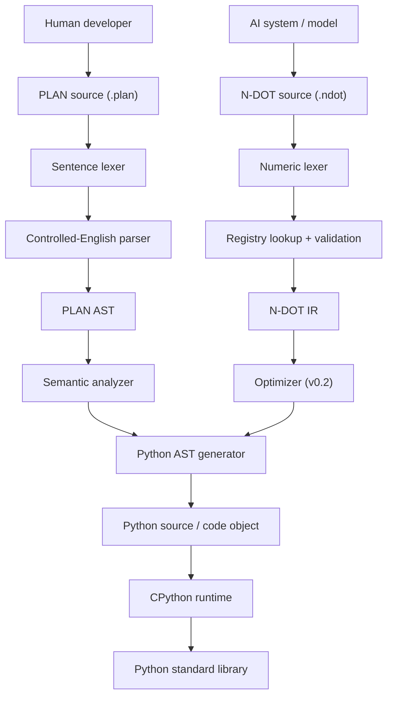

# AO Languages — PLAN & N-DOT

**Status:** Experimental internal implementation for AO. The language specifications and implementation are actively evolving.

Two languages designed for AO's internal development workflow. They work together and share one execution backend:

- **PLAN** is intended for AO contributors, junior developers, and non-technical team members who need to build small tools without learning full Python first.
- **N-DOT** is intended primarily for AI systems and code generators, giving AO AI workflows a compact, structured, and validated execution language.
- **Core developers** can use PLAN for rapid application development and Python when lower-level control is needed.

| | **PLAN** | **N-DOT** |
|---|---|---|
| Written by | Humans | AI systems / code generators |
| Source alphabet | Controlled English sentences | Only `0123456789` and `.` |
| Paradigm | Imperative, block-structured | Flat register (slot) instructions with block markers |
| Main domain | General software, scripts, automation | Tensors, models, datasets, inference |
| Compiles to | Python source / Python AST | Python source + the `ndot_runtime` support module |
| File extension | `.plan` (UTF-8) | `.ndot` (ASCII) |
| Spec | [spec/PLAN.md](spec/PLAN.md) | [spec/NDOT.md](spec/NDOT.md) |

**The main idea:** people write PLAN, AI systems write N-DOT, and Python runs both underneath.

---

## 1. Architecture



### Shared design principles

1. **Controlled, not arbitrary.** Neither language tries to "understand" input. PLAN reads like English, but it has a fixed grammar. N-DOT is numeric, but every number has an entry in the registry.
2. **Deterministic compilation.** The same source always produces the same Python. No AI model sits inside either compiler.
3. **Python does the heavy lifting.** Neither language has its own VM. Both compile to plain Python that a human can read.
4. **Errors speak the source language.** Runtime errors are mapped back to the PLAN sentence or N-DOT instruction that caused them.
5. **No third-party dependencies in v0.1.** Generated code and support runtimes use only the Python standard library.

---

## 2. Planned toolchain

```text
plan run    hello.plan          # compile + execute
plan build  hello.plan -o hello.py
plan check  hello.plan          # parse + semantic checks only
plan python hello.plan          # print generated Python

ndot run    model.ndot
ndot build  model.ndot -o model.py
ndot check  model.ndot
ndot dis    model.ndot          # numeric source → readable mnemonic listing
ndot asm    model.ndasm         # mnemonic listing → numeric source (debug aid)
```

## 3. Repository layout

### 3.1 Active v0.1 implementation tree

```text
PLAN-and-NDOT/
├── plan/
│   ├── lexer.py          # sentences, strings, numbers, indentation
│   ├── parser.py         # controlled-English grammar → AST
│   ├── ast_nodes.py      # dataclasses
│   ├── semantic.py       # scopes, name resolution, English diagnostics (P301–P308)
│   ├── phrases.py        # phrase library ("square root of" → math.sqrt)
│   ├── python_codegen.py # PLAN AST → Python ast
│   ├── runtime.py        # helper module used by generated code
│   └── cli.py            # run, build, check, python
├── ndot/
│   ├── lexer.py          # digit/dot validation (N101–N104)
│   ├── registry.json     # normative opcode table with permissions
│   ├── registry.py       # opcode lookup & definitions
│   ├── validator.py      # arity, enums, blocks, slots, dataflow (N201–N209)
│   ├── disasm.py         # disassembler & assembler (.ndasm ↔ .ndot)
│   ├── python_backend.py # N-DOT instructions → Python code
│   ├── ndot_runtime.py   # pure-Python tensors, models, datasets, sandbox gate (N301–N303)
│   └── cli.py            # run, build, check, dis, asm (--allow-files, --allow-network)
├── common/
│   ├── diagnostics.py    # shared Diagnostic and CompileError reporting
│   ├── sourcemap.py      # line mapping
│   └── sandbox.py        # sandbox permissions & module allow-lists
├── tests/
│   ├── test_plan.py      # PLAN compiler & semantic unit tests
│   └── test_ndot.py      # N-DOT validator & runtime unit tests
├── vscode-extension/
│   ├── src/
│   │   ├── extension.ts  # extension activation & command registration
│   │   ├── plan.ts       # PLAN execution, build, and Python preview
│   │   ├── ndot.ts       # N-DOT execution, build, disasm, and asm
│   │   └── diagnostics.ts# real-time linter for .plan and .ndot
│   ├── syntaxes/
│   │   ├── plan.tmLanguage.json # TextMate grammar for PLAN
│   │   └── ndot.tmLanguage.json # TextMate grammar for N-DOT & .ndasm
│   ├── language-configuration.json
│   ├── package.json
│   └── README.md
└── spec/
    ├── PLAN.md           # PLAN language specification
    └── NDOT.md           # N-DOT specification
```

### 3.2 Roadmap components (Planned for v0.2+)

The following modules are designed as part of future milestones:
- `ndot/ir.py`: Multi-level intermediate representation with block tree (v0.2)
- `ndot/optimizer.py`: Constant folding, dead-slot elimination, loop invariant motion (v0.2)
- `common/loader.py`: Unified multi-language dynamic module loader (v0.2)


---

## 4. Roadmap

| Version | PLAN | N-DOT |
|---|---|---|
| **v0.1** | Variables, conditions, loops, functions, lists, dictionaries, Python imports, phrase library, try/on-failure | Lexer, registry, literals, slots, control blocks, functions, math, I/O, pure-Python tensors, linear/logistic/MLP models, datasets |
| **v0.2** | Classes ("kinds of things"), async, file and web helpers, calling N-DOT programs | Optimizer (constant folding, dead-slot elimination), model graphs, extension registries via `903` |
| **v0.3** | `plan build --target ndot` (PLAN lowers to N-DOT IR) | Optional NumPy / PyTorch / ONNX backends behind the same opcodes |
| **v1.0** | Stable grammar, package manager | Frozen core registry 100–999 |

## 5. Open questions (to decide before implementation)

1. **Indexing.** This draft uses 1-based indexing in PLAN (`item 1 of names`) because it reads naturally, and 0-based indexing in N-DOT because it maps directly onto Python. Is that split acceptable?
2. **PLAN keyword language.** v0.1 is English only. Should the grammar tables be designed so other natural languages can be added later?
3. **N-DOT strictness.** This draft forbids all whitespace, including a trailing newline. Should tools accept and strip a single trailing newline?
4. **Interop.** Should a PLAN program be able to embed or call N-DOT directly in v0.2 (`Run the N-DOT program "model.ndot" ...`)?
